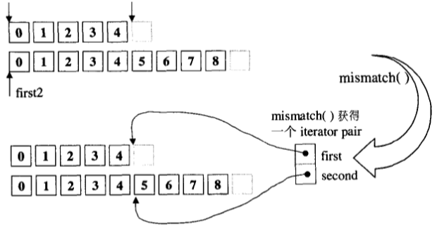

# mismatch

平行比较两个序列，指出两者之间的第一个不匹配点，返回一对迭代器，分别指向两个序列中的不匹配点。

# includes

# remove

# rotate

# unique

# lower_bound

# sort

STL 中的 sort 算法，数据量大时采用 Quick Sort，分段递归排序，一旦分段后的数据量小于某个门槛，为避免 Quick Sort 的递归调用带来过大的额外负荷，改用 Insert Sort，如果递归层次过深，还会改用 Heap Sort。

# equal_range

