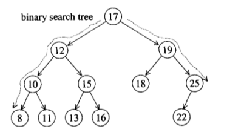
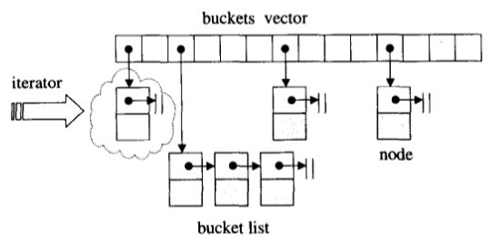

# 树

## 二叉树基本概念

## 二叉搜索树

### 插入操作

### 删除操作

## AVL 树

**AVL 树插入节点，破坏平衡：**

**单旋**

**双旋**

## 红黑树

### 插入操作

**假设 RB-Tree 插入 4 个新节点：3,8,35,75**

根据红黑树的要求：

 - 新插入节点应该是红色
 - 新插入节点的父节点应该是黑色

如果插入后不满足上述条件，则要调整颜色和旋转

定义一些名称：

- X：插入节点
- P：X 的父节点
- G：X 的祖父节点
- S：X 的伯父节点，即父节点的兄弟
- GG：X 的祖父节点

#### 情况1:S 为黑且X为外侧插入

- P、G 单旋转
- 更改 P、G 的颜色

#### 情况2:S 为黑且X为内侧插入

- P、X 单旋转
- 更改 G、X 的颜色
- G 单旋转

#### 情况3:S 为红且X为外侧插入

- P 、G 单旋转
- 如果此时 GG 是黑色，则结束，如果 GG 是红色问题转为情况4

#### 情况4:S 为红且X为内侧插入

- P、G 单旋转
- 改 X 的颜色
- 如果 GG 是红色，继续向上，直到不再有父子连续是红色

### 红黑树迭代器

# hash 表

## 解决碰撞

### 线性探测

### 二次探测

### 开链法

