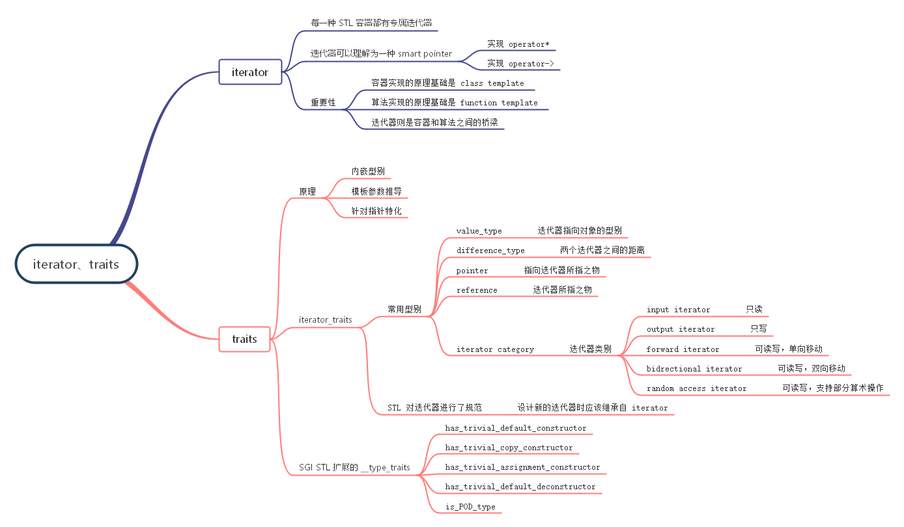
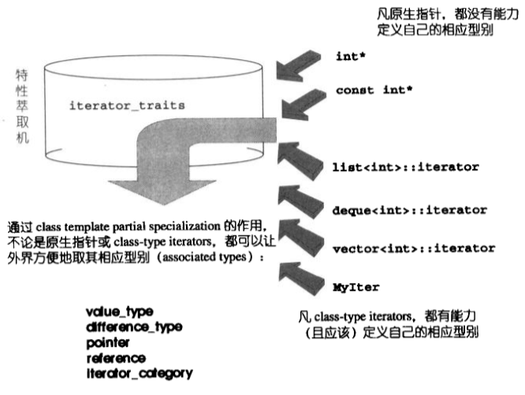
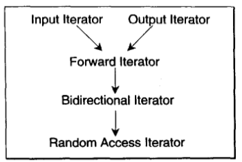

# iterator_traits



# 迭代器类型



针对迭代器型别的标记类：

```
struct input_iterator_tag {};
struct output_iterator_tag {};
struct forward_iterator_tag {};
struct bidirectional_iterator_tag {};
struct random_access_iterator_tag {};
```

# SGI STL __type_traits

针对 __type_traits 的标记类：

```
struct __true_type{};
struct __false_type{};
```


