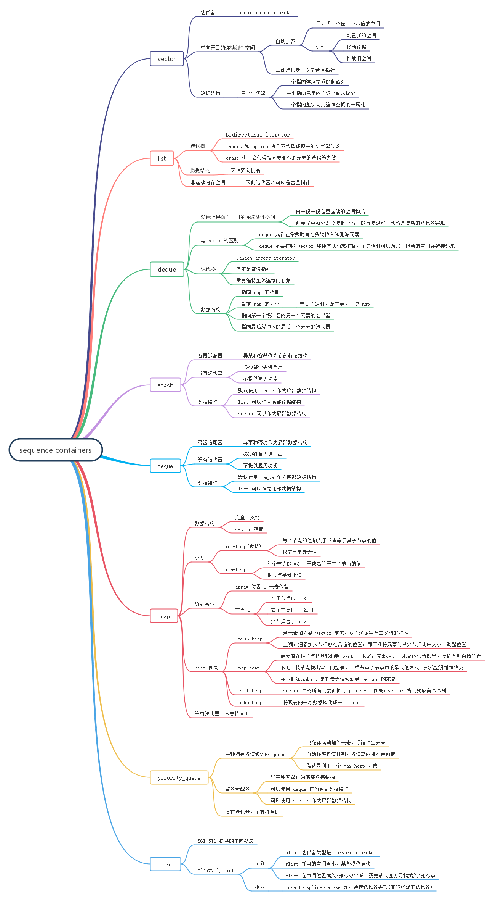

# vector

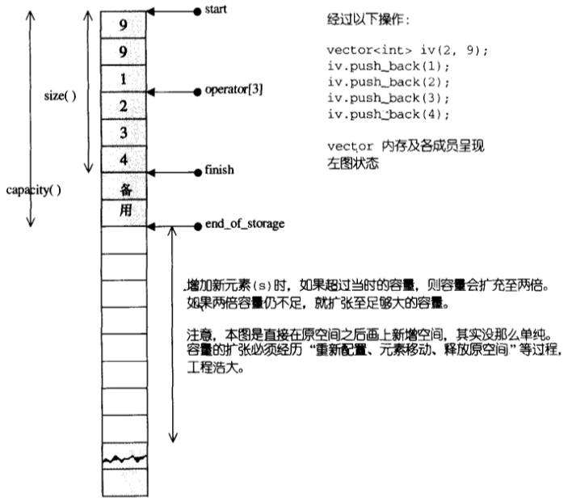

# list

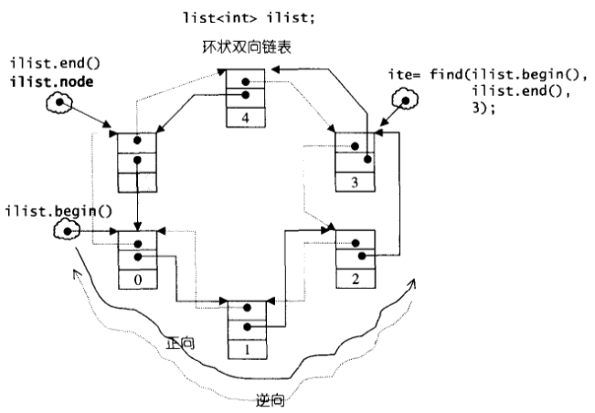

# deque

**双端皆可操作：**

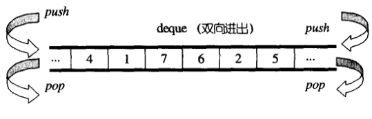

deque 的迭代器十分复杂，因而要尽量避免使用 deque，尽量使用 vector，例如给 deque 排序时，可以先将元素复制到 vector 中，排序完成后再复制回 deque。

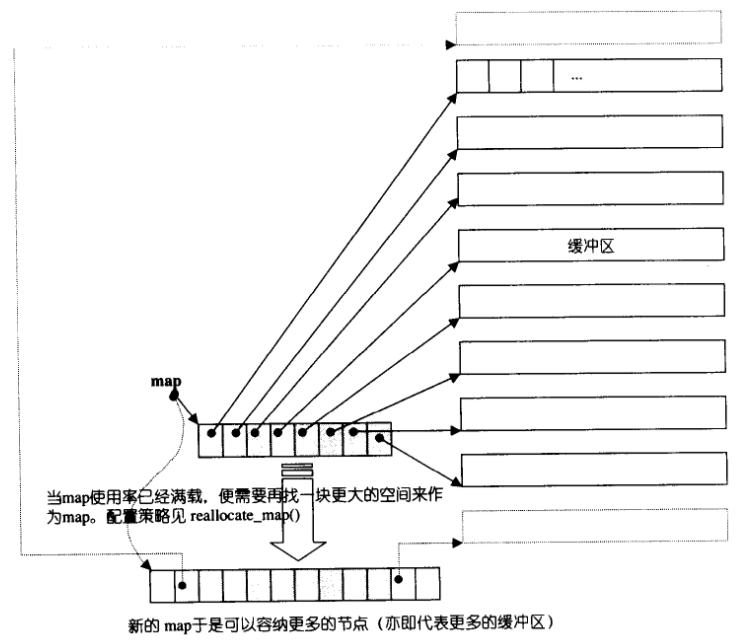

**deuqe 中控器、缓冲区、迭代器之间的关系：**

# stack

**先进后出：**

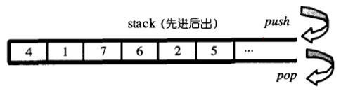

# queue

**先进先出：**

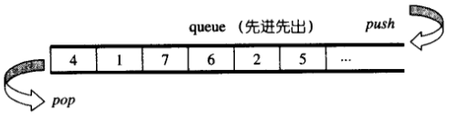

# heap

**完全二叉树以及 array 表述：**

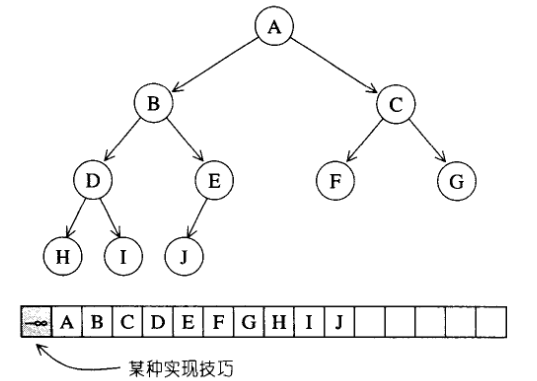

# heap 算法

## push_heap

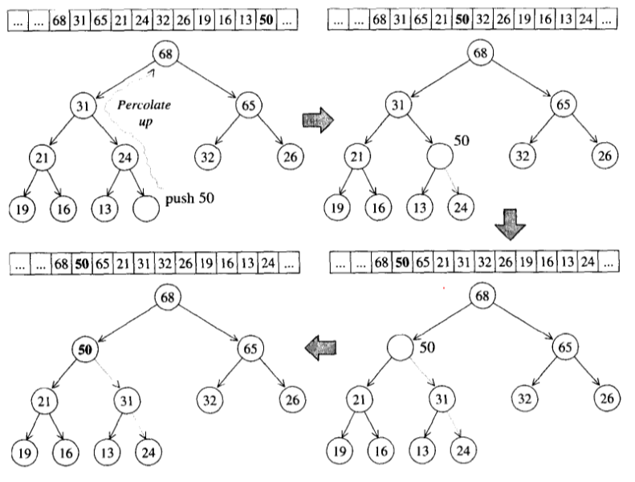

## pop_heap

# priority_queue

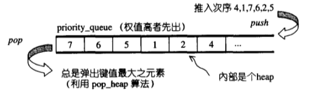

# slist

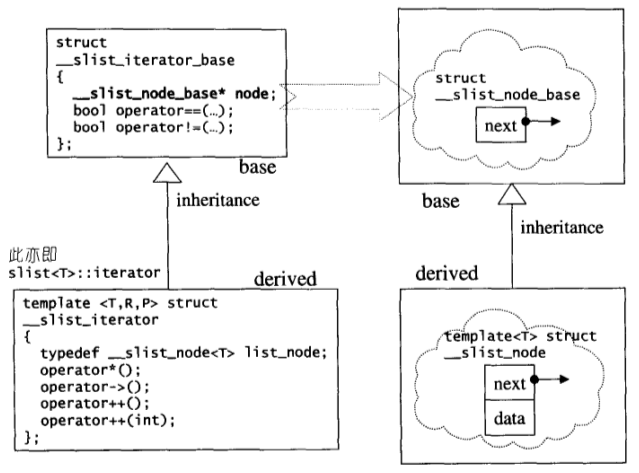